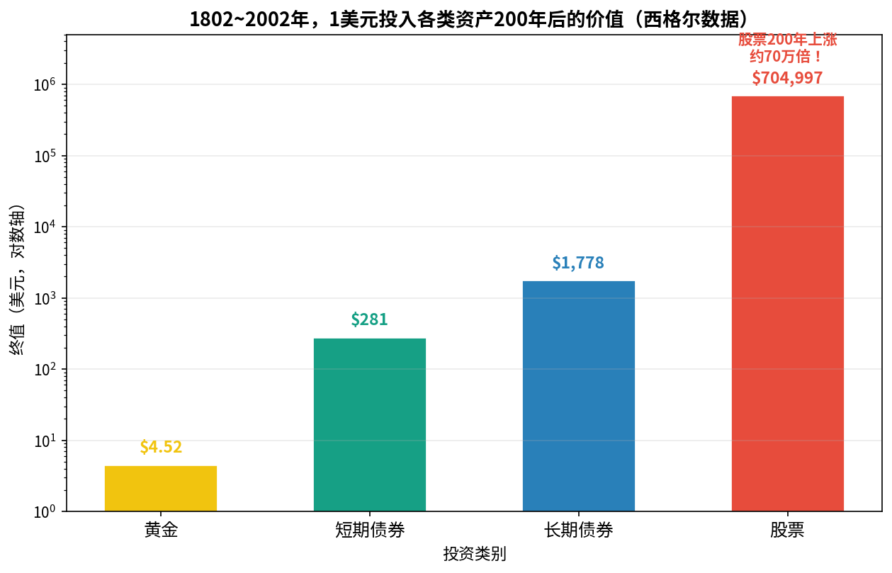
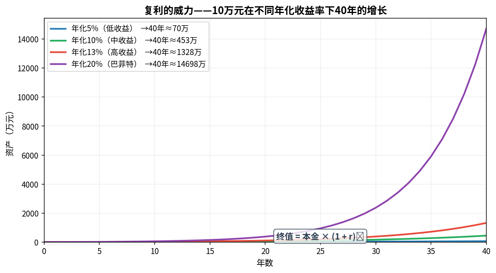
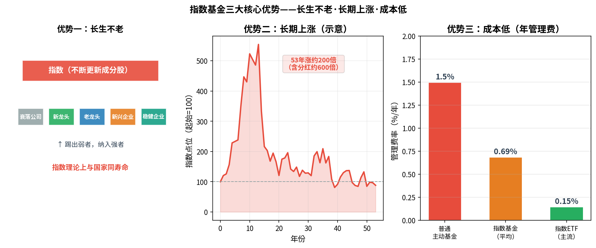
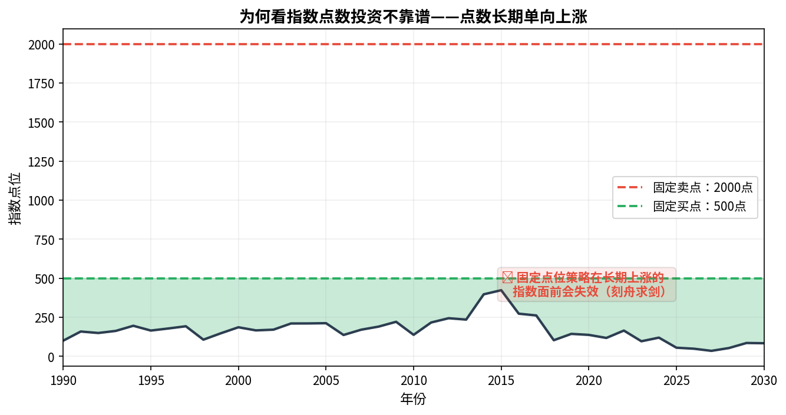

# 第1章 投资新手的建议 · 第2章 为什么选指数基金

> **银行螺丝钉《指数基金投资指南》核心笔记**
> 核心主张：低估值 × 定投指数基金，是最适合普通人的稳健投资路径。

---

## 第1章：投资新手的建议

### 资产 vs 消费

> **能为我们"生钱"的就是资产；花掉就消失的是消费。**

| 分类 | 例子 | 特征 |
|------|------|------|
| 资产 | 股票、基金、房产 | 持续产生现金流，能增值 |
| 消费 | 烟酒、外卖、娱乐 | 花完即无 |
| **现金** | 银行存款 | **不是资产！** 长期贬值 |

**财务自由的定义**：拥有足够多"钱生钱"的资产，不工作也有持续现金流。

### 找到长期收益最高的资产

**西格尔教授（美国）200年数据**：

$$1802\text{年投入1美元} \rightarrow 2002\text{年终值}$$

| 资产 | 终值 |
|------|------|
| 黄金 | $4.52 |
| 短期债券 | $281 |
| 长期债券 | $1,778 |
| **股票** | **$704,997** |

> **结论：股票是长期收益最高的资产类别，唯一能长期跑赢通胀。**

### 看收益，更要看风险

**复利公式**：

$$A = P \times (1 + r)^n$$

| 年化收益率 | 40年后（10万元本金） |
|-----------|---------------------|
| 5% | 约70万 |
| 10% | 约453万 |
| 13% | 约1,322万 |
| 20%（巴菲特） | 约8,360万 |

**警惕高收益陷阱**：
- 长期可持续的股票年化约 9%~15%
- 声称"月赚30%"、"保本高收益" → **100% 是骗局**
- 巴菲特50年年复合仅约20%，这已是人类顶级水平

### 最适合上班族的基金——指数基金

- 基金 = 一个装资产的"篮子"
- 货币基金 ≈ 活期现金替代品
- 债券基金 ≈ 低风险固定收益
- **指数基金 ≈ 买入整个股票市场的一部分**

> 巴菲特唯一公开多次推荐的品种：**低成本指数基金**

---

## 第2章：为什么选指数基金

### 什么是指数

指数 = 一份**选股规则**，反映一篮子股票的整体平均走势。

例：沪深300 = 从沪深两市挑选规模最大、流动性最好的300只股票，按市值加权平均。

**三个重要指数系列（国内）**：
- 上交所：上证系列（上证50、上证180等）
- 深交所：深证系列
- 中证公司：中证系列（沪深300、中证500等）

### 指数基金三大核心优势

**1. 长生不老**
- 单只股票会破产退市，但指数会自动踢出弱者、纳入强者
- 道琼斯指数创立100年，最初20只成分股只有1只存活至今，但指数从100点涨到近2万点
- 指数的寿命 ≈ 国家的寿命

**2. 长期上涨**
- 背后的公司每年盈利→再投入→资产增加→盈利更多（复利逻辑）
- 还能抵御通货膨胀（产品提价→利润增加）
- 恒生指数53年上涨200倍；含分红约600倍

**3. 成本低**
| 类型 | 年均管理费 |
|------|-----------|
| 普通主动基金 | 约1.5% |
| 国内指数基金 | 约0.69% |
| 主流指数ETF | 约0.15% |
| 美股SPY | 0.09% |

### 为何看指数点数投资不靠谱

指数点数长期单向上涨（上证综指从100点涨到3000+点）。如果固定"2000点买、2500点卖"，长期看是刻舟求剑，越来越失效。

**正确做法**：用估值指标（PE/PB）替代绝对点数，判断相对高低。

### 指数基金规避三大风险

| 风险类型 | 说明 | 指数基金应对 |
|---------|------|------------|
| 黑天鹅风险 | 个股突发事件（造假、行业打压） | 持有几十~几百只，单股黑天鹅影响极小 |
| 本金永久损失 | 公司破产、股价归零 | 指数不会选亏损严重的公司 |
| 制度风险 | 利益输送、内幕交易 | 选股规则公开透明，无法操控 |

---

*← [总索引](lsd_index.md) | → [第3-4章笔记](lsd_ch3_ch4.md)*
