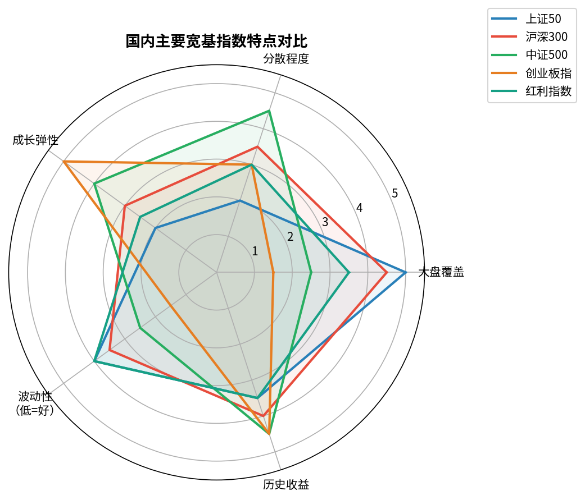
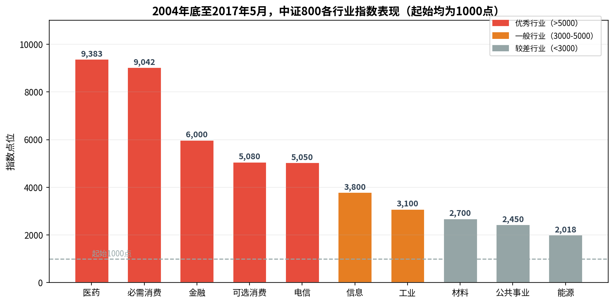
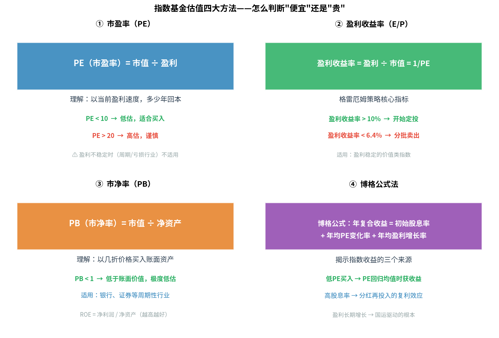
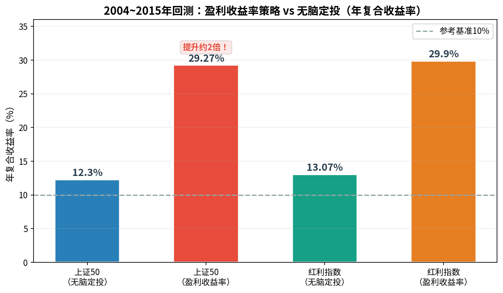
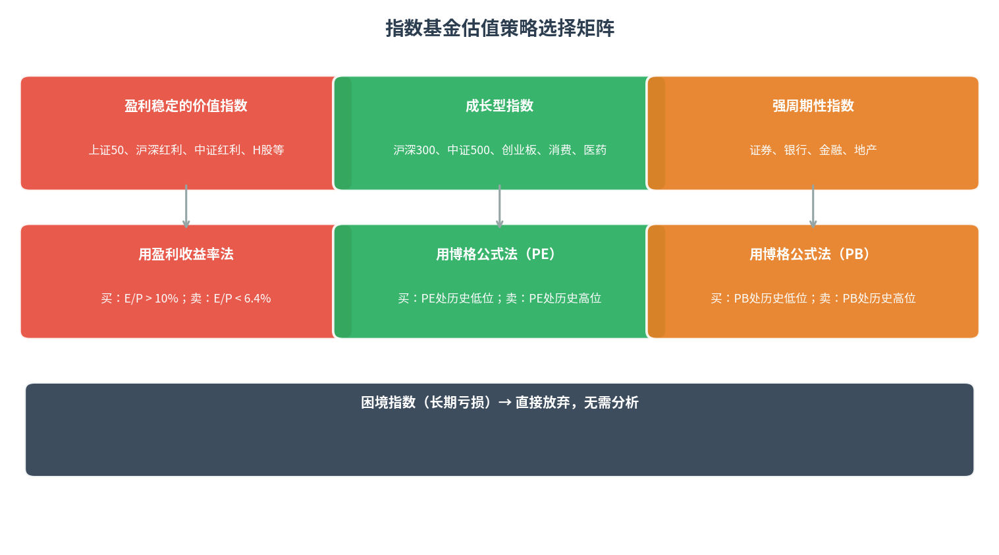

# 第3章 常见指数基金品种 · 第4章 如何挑选——估值方法

---

## 第3章：常见指数基金品种

### 分类：宽基 vs 行业

| 类型 | 特点 | 代表 | 难度 |
|------|------|------|------|
| **宽基指数** | 不限行业，代表市场整体 | 沪深300、中证500 | ⭐ 入门首选 |
| **行业指数** | 只投某一行业 | 医药、消费、证券 | ⭐⭐⭐ 需行业研判 |

> 新手建议：先从宽基开始，积累经验再投行业指数。

### 主要宽基指数对比

| 指数 | 代码 | 成分 | 特点 |
|------|------|------|------|
| **上证50** | 000016 | 上交所最大50家 | 大盘蓝筹，金融权重高；只有上交所股票 |
| **沪深300** | 000300 | 沪深最大300家 | 最具代表性，覆盖市值约60% |
| **中证500** | 000905 | 排名301~800家 | 中盘成长，与沪深300无重叠 |
| **创业板指** | 399006 | 创业板前100家 | 科技成长，波动大弹性高 |
| **上证红利** | 000015 | 上交所高股息50只 | 策略加权，熊市抗跌 |
| **中证红利** | 000922 | 沪深高股息100只 | 覆盖更广，历史收益略优 |
| **恒生指数** | HSI | 港交所50大 | 成熟开放，以境外投资者为主，QDII购买 |
| **H股指数** | HSCEI | 港交所前40家H股 | 内地公司在港代言人，与A股高度关联 |
| **纳斯达克100** | NDX | 美国非金融前100 | 科技巨头集中，32年年化13.5% |
| **标普500** | SPX | 美国前500大 | 巴菲特推荐，76年年化7.4% |

### 值得投资的行业

**两类值得投资的行业**：

**① 天生容易赚钱的优秀行业**
- **必需消费**（食品饮料）：需求稳定，护城河强，抗经济周期
- **医药**：人口老龄化，刚需永续
- **可选消费**：受益人均收入提升，升级换代

**② 强周期性行业**（在周期底部买入）
- **银行**：利差收益，百业之母
- **证券**："周期之王"，牛市弹性极大
- **地产**：周期明显，重资产

> 🚫 不值得投资：能源（大宗商品价格驱动）、长期亏损行业

### 场内 vs 场外

| 项目 | 场内基金（ETF/LOF） | 场外基金 |
|------|-------------------|---------|
| 购买渠道 | 证券账户，股票软件 | 天天基金、支付宝 |
| 交易价格 | 实时撮合，有溢折价 | 每日净值，无溢折价 |
| 自动定投 | ❌ 不支持 | ✅ 支持 |
| 费率 | 极低（佣金0.02~0.05%） | 申购费打折后约0.1% |

**联接基金**：ETF的场外版，方便自动定投，费率与对应ETF相同（不额外收费）。

---

## 第4章：如何挑选适合投资的指数基金

### 价值投资三大理论（格雷厄姆）

1. **价格与价值的关系**：股价短期随情绪波动，长期回归内在价值（巴菲特：股价像跟主人散步的小狗）
2. **能力圈**：只投自己真正了解的品种，知道它大致值多少钱
3. **安全边际**：在价格大幅低于价值时才买入，"用0.4元买价值1元的东西"

### 四大估值指标

**① 市盈率（PE）**

$$PE = \frac{\text{市值}}{\text{盈利}}$$

- 理解：以当前盈利速度，多少年回本
- 适用：流通性好、**盈利稳定**的品种（宽基指数为主）
- **PE陷阱**：周期行业低PE不代表低估（熊市利润暂时高→PE显示低，但景气周期结束就暴跌）

**② 盈利收益率（E/P）**

$$\text{盈利收益率} = \frac{\text{盈利}}{\text{市值}} = \frac{1}{PE}$$

- 格雷厄姆最常用指标，PE的倒数
- 比较基准：10年期国债收益率（约3.5%）×2 = 7%

**③ 市净率（PB）**

$$PB = \frac{\text{市值}}{\text{净资产}}$$

- 适用：资产稳定、净资产可衡量的行业（银行、证券、地产）
- PB < 1 = 以低于账面价值买入

**④ 博格公式（指数基金收益公式）**

$$\text{年复合收益率} \approx \underbrace{\text{初始股息率}}_{\text{分红收益}} + \underbrace{\Delta PE/年}_{\text{估值变化收益}} + \underbrace{\text{年盈利增长率}}_{\text{业绩增长收益}}$$

- 决定股市长期回报的三大因素
- 低PE买入 → $\Delta PE$ 为正（从低位回归均值）
- 长期看，只要国家经济发展，盈利增长是正的

### 两大挑选策略

**策略一：盈利收益率法（简单版，适合新手）**

| 盈利收益率 | 操作 |
|-----------|------|
| **> 10%** | **分批买入/开始定投** |
| 6.4%~10% | 持有已有份额，暂停买入 |
| **< 6.4%** | **分批卖出** |

- 6.4% 来自：国内债券基金长期平均年化约6.4%，低于此则不如换债券
- 历史回测：2004~2015年，盈利收益率策略年复合约**29%**，无脑定投仅约12%

**适用指数**：上证50、上证红利、中证红利、基本面50、央视50、50AH优选、恒生、H股

**策略二：博格公式法（适合成长/周期指数）**
- 对比指数历史PE/PB波动范围
- 当前PE/PB处于**历史较低位置** → 可投资（未来均值回归带来收益）
- 需要查历史数据，难度略高

**适用指数**（PE衡量）：沪深300、中证500、创业板、消费、医药、可选消费、养老

**适用指数**（PB衡量）：证券、银行、金融、非银金融、地产

### 估值策略总览

| 盈利状态 | 使用指标 | 代表指数 |
|---------|---------|---------|
| 盈利稳定（价值型） | **盈利收益率法（E/P）** | 上证50、红利 |
| 盈利高速增长（成长型） | **博格公式（PE）** | 沪深300、中证500、消费、医药 |
| 盈利周期波动（周期型） | **博格公式变种（PB）** | 证券、银行、地产 |
| 长期亏损（困境） | **直接放弃** | — |

### 怎么查指数估值

1. **作者公众号"定投十年赚十倍"**：每日推送各指数PE/PB估值（最便捷）
2. **中证指数官网**：常见宽基指数的PE/PB历史数据
3. **恒生指数官网**：港股指数估值
4. **集思录、且慢**：第三方估值工具

---

*← [第1-2章笔记](lsd_ch1_ch2.md) | → [第5-6章笔记](lsd_ch5_ch6.md) | [总索引](lsd_index.md)*
