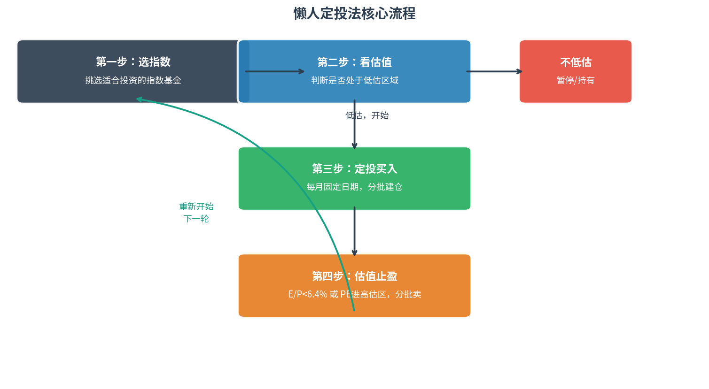
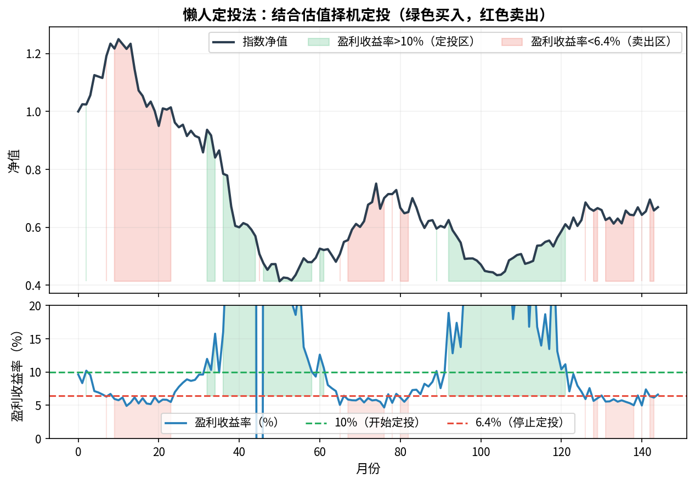
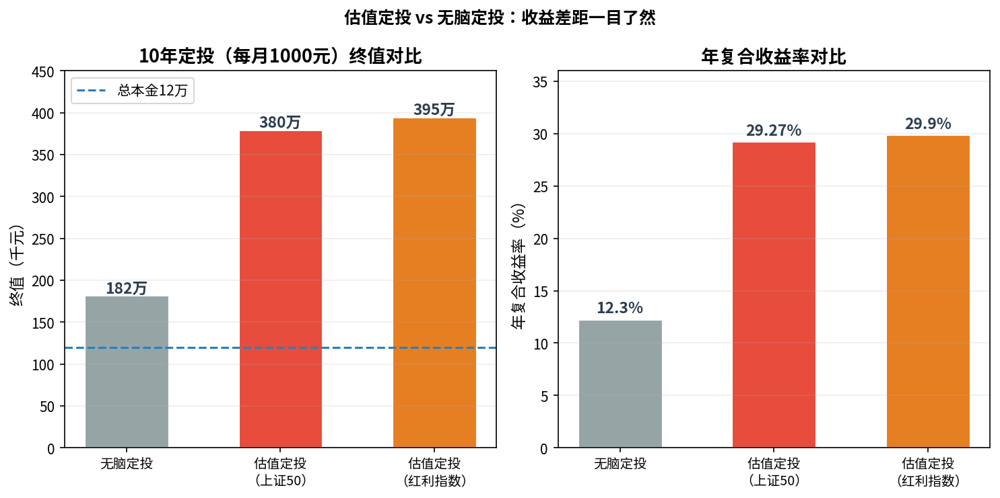
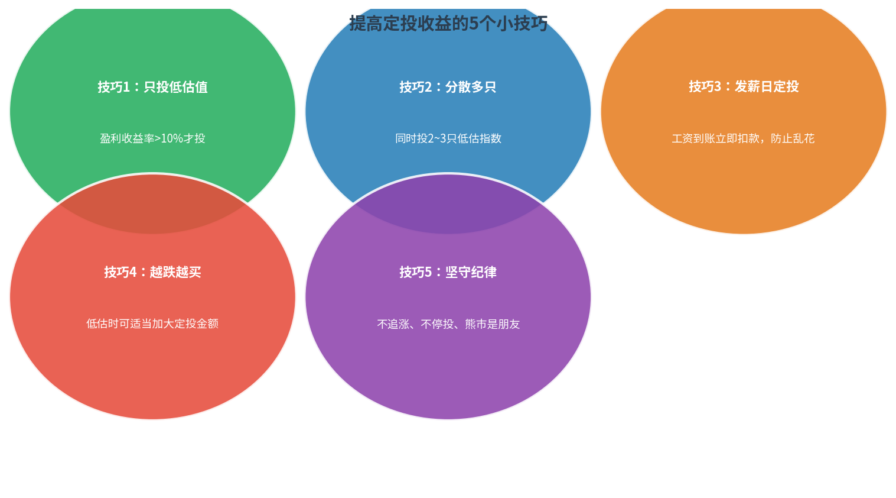
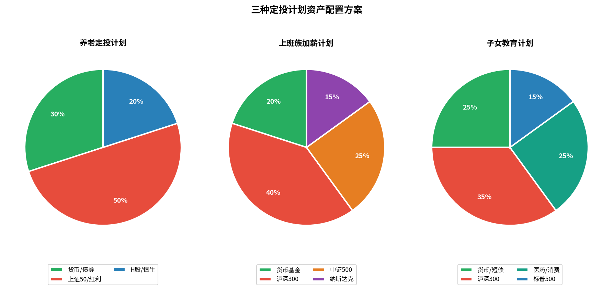

# 第5章 如何买卖指数基金：懒人定投法 · 第6章 构建定投计划

---

## 第5章：懒人定投法

### 什么是定投

**定投** = 定期定额投资，每隔固定时间买入固定金额的指数基金。

类比：养老保险/社保 = 国家强制执行的定投制度。

**定投三大好处**：
1. **门槛低**：100元起，随时可开始
2. **无需择时**：固定日期买入，不需要判断涨跌
3. **分摊成本**：涨时少买、跌时多买，自动摊薄平均成本

**适合定投的四类人**：上班族、大忙人、低风险偏好者、为未来规划者

---

### 懒人定投法核心流程



**核心原则：只在低估时定投，高估时卖出，不高估时持有等待。**

---

### 怎么买：结合估值的懒人定投法

**第一步：选指数** — 从宽基指数（沪深300、红利、H股等）中选1~3只

**第二步：判断估值** — 每月定投日查看盈利收益率（E/P）

| 盈利收益率 E/P | 操作 |
|--------------|------|
| **> 10%** | ✅ **继续定投**（低估，值得买） |
| 6.4% ~ 10% | ⏸ **暂停定投**，持有已买入份额 |
| **< 6.4%** | 🔴 **分批卖出**（高估，不如换债券） |

> **6.4% 来源**：债券基金长期平均年化约6.4%，指数基金收益不足这个数，性价比就不如债券了。

**"结合估值 vs 无脑定投"对比**：



---

### 怎么卖：分批止盈，不要一次性清仓

**止盈信号**：
- 盈利收益率 < 6.4%（估值偏高）
- PE 进入历史 80% 分位以上

**操作方法**：
- 将持有份额分成10等份
- 每次触发止盈条件卖出1份，共10次卖完
- 分批卖出可分散高点不确定性

**为什么不一次全卖**：市场可能在高估后继续高估，分批可兼顾"拿住"和"止盈"。

---

### 怎么算定投年复合收益率

**XIRR 公式**（不规则现金流年化）：适合计算定投收益，各平台 App 均有显示。



**历史回测数据（2004~2015年）**：

| 策略 | 上证50 | 红利指数 |
|------|--------|---------|
| 无脑定投 | 12.3% | 13.07% |
| **盈利收益率定投** | **29.27%** | **29.9%** |

> 配合估值策略，年复合收益率提升约2~2.5倍！

---

### 提高定投收益的5个小技巧



1. **只投低估值**：盈利收益率 > 10% 才买
2. **分散多只**：同时定投2~3只低估指数，降低单一风险
3. **发薪日定投**：工资到账立即执行，防止拖延和乱花
4. **越跌越买**：低估时可适当加大金额（如双倍定投）
5. **坚守纪律**：熊市是朋友，不停投、不追涨

---

### 定投的金额怎么定

**参考公式**：

$$\text{月定投金额} \approx \frac{\text{月结余}}{2}$$

- 定投资金至少要 **3年内不动用**
- 另留一半结余作备用金，以备不时之需

---

## 第6章：构建属于自己的定投计划

### 三种定投计划模板



**方案一：养老定投计划（30~55岁，投资期10年以上）**

| 品种 | 配置比例 | 说明 |
|------|---------|------|
| 上证50 / 沪深红利 | 50% | 核心稳健仓，低估值蓝筹 |
| 恒生指数 / H股 | 20% | 港股分散，估值更低 |
| 货币 / 纯债基金 | 30% | 流动性缓冲 |

**方案二：上班族加薪计划（20~40岁，收入稳定，追求成长）**

| 品种 | 配置比例 | 说明 |
|------|---------|------|
| 沪深300 ETF | 40% | 宽基核心 |
| 中证500 | 25% | 成长补充 |
| 纳斯达克100 | 15% | 美股科技，分散汇率 |
| 货币基金 | 20% | 备用金 |

**方案三：子女教育定投计划（目标明确，10~15年期）**

| 品种 | 配置比例 | 说明 |
|------|---------|------|
| 沪深300 | 35% | 核心权益 |
| 医药 / 消费行业 | 25% | 长期优质赛道 |
| 标普500（QDII） | 15% | 全球分散 |
| 货币 / 短债 | 25% | 临近目标年转移 |

---

### 定投计划实操步骤

```
1. 开户：天天基金网（场外） + 证券账户（ETF）
2. 确定目标：养老/教育/加薪，对应品种和期限
3. 设置金额：月结余的50%，保证3年不动用
4. 固定时间：发薪日次日，月月执行
5. 每月检查：查看估值，判断继续/暂停/卖出
6. 坚守纪律：不因短期涨跌停投或追高
```

### 投资实例：港股工薪族定投恒生指数

- 1964年（18岁）开始，每年投入收入的20%
- 投入总本金：65万元
- 2004年退休（58岁）时资产：**660万元**
- 若坚持到2014年（68岁）：**1,576万元**

> 仅靠年复一年的定投，普通工薪族也可实现千万资产！

---

*← [第3-4章笔记](lsd_ch3_ch4.md) | → [第7-8章笔记](lsd_ch7_ch8.md) | [总索引](lsd_index.md)*
