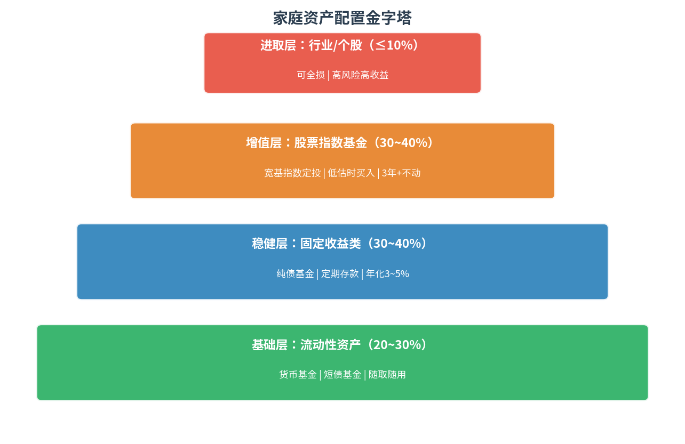
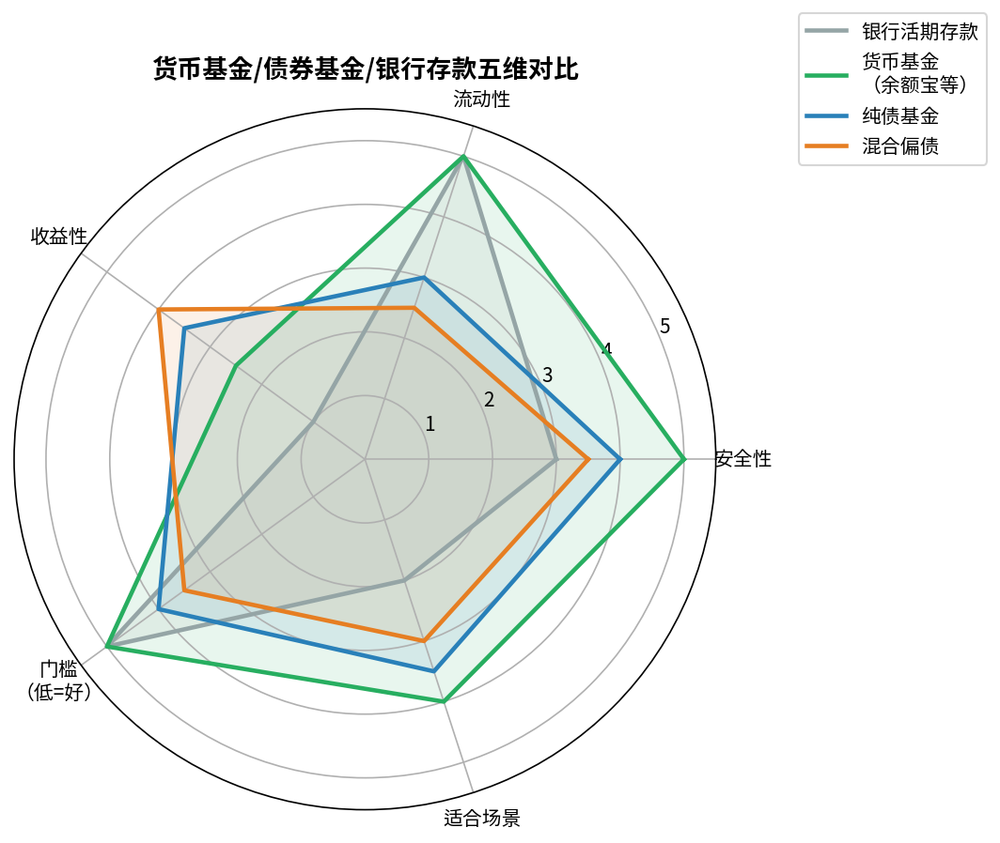
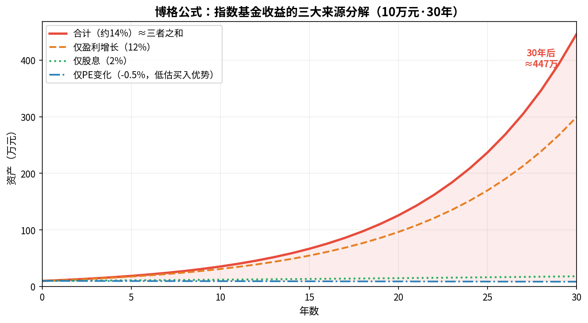
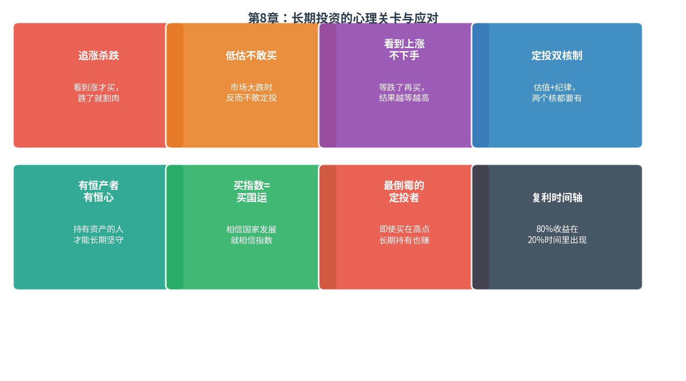
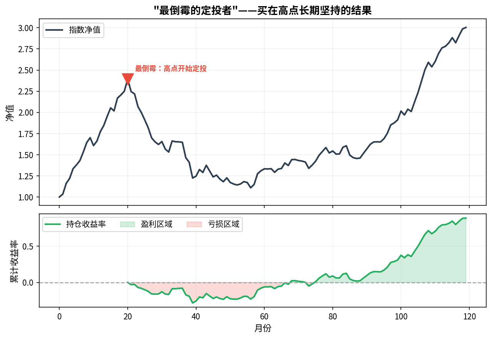

# 第7章 做好家庭资产配置 · 第8章 长期投资的心理建设

---

## 第7章：做好家庭资产配置

### 货币基金：随取随用的"余额宝"

**是什么**：主要投资短期货币工具（国债逆回购、银行存单、短期债券），**几乎无亏损风险**。

| 特点 | 说明 |
|------|------|
| 安全性 | ★★★★★ 历史上极少出现负收益 |
| 流动性 | ★★★★★ T+0 或 T+1 到账 |
| 收益性 | ★★☆☆☆ 约1.5~3%，略高于活期 |
| 适用 | 日常现金管理、应急备用金 |

**典型产品**：余额宝（天弘）、微信零钱通（华夏）

> 📌 货币基金≠存款，收益率随市场利率浮动，但保本性极高。

---

### 债券基金怎么买

**是什么**：主要投资国债、地方政府债、企业债等，**低风险稳收益**。

**分类**：
- **纯债基金**：100%投债券，不投股票
- **一级债基**：可参与打新股，略高收益
- **二级债基**：可配置少量股票（≤20%）

**注意**：债券基金≠无风险。**利率上升时，债券价格下跌**，债券基金也会阶段性亏损。持有1年以上通常可平滑风险。

**挑选原则**：
- 选纯债基金（不含股票）
- 规模 > 5亿元，避免清盘风险
- 管理费 < 0.6%/年

---

### 家庭资产配置金字塔

**四层结构（从底到顶风险依次增加）**：

| 层次 | 占比 | 品种 | 目标 |
|------|------|------|------|
| **基础层** | 20~30% | 货币基金、活期 | 流动性，随时可取 |
| **稳健层** | 30~40% | 纯债基金、短债 | 年化3~5%，低风险增值 |
| **增值层** | 30~40% | 宽基指数定投 | 年化8~15%，长期增值 |
| **进取层** | ≤10% | 行业基金、个股 | 可接受全部损失 |

**配置三原则**：
1. 应急备用金（3~6个月支出）必须放基础层，不参与投资
2. 3年内要用的钱不放增值层
3. 各层比例根据年龄/风险偏好调整

**货币/债券/指数对比**：

---

## 第8章：长期投资的心理建设

### 指数基金的复利从哪里来

**博格公式再解析**：

$$\text{年复合收益} = \underbrace{\text{初始股息率}}_{\text{分红}} + \underbrace{\Delta PE/年}_{\text{估值修复}} + \underbrace{\text{盈利增长率}}_{\text{业绩驱动}}$$

三个来源都为正，则长期必然赚钱：
- **股息**：只要持有就有现金流，分红再投入加速复利
- **估值修复**：低估买入，等待市场情绪从悲观回正常
- **盈利增长**：只要国家经济继续发展，企业利润长期上涨

---

### 长期定投路上的7大心理关卡

**关卡1：买入低估值，为啥还会下跌？**
- 低估≠马上涨，市场先生情绪化，低估可能持续很久
- 但只要够分散、够有耐心，低估终将修复
- **应对**：把下跌看作继续低价买入的机会，而非恐慌出逃的信号

**关卡2：《甜蜜蜜》与香港股灾**
- 1987年美股崩盘，港股跟着跌44%（与港股本身无关）
- 境外投资者主导港股 → 境外风险会传导到港股
- **应对**：了解品种特性，港股基金要有承受外部冲击的心理准备

**关卡3：最倒霉的定投者**

- 假设每次都在牛市高点买入：第一次高点、第二次高点……
- 结果呢？**长期坚持定投，仍然盈利**
- 因为定投在低点买的更多，高点买的少，总体摊低了成本
- **结论**：比择时更重要的是"在场"

**关卡4：买指数就是买国运**
- 日本经济衰退20年，日经指数原地踏步，但**日本医药指数**同期大涨
- 如果指数背后的公司长期有竞争力，国家经济整体发展，指数就会长期上涨
- **应对**：选择有长期发展逻辑的国家和行业，相信即可

**关卡5：看到上涨定投下不去手**
- 熊市低谷时最应该定投，偏偏最难下手
- **应对**：设置自动定投；提前写下"如果跌30%我会怎么做"的投资计划书

**关卡6：定投的"双核制"**

$$\text{纪律} \times \text{估值} = \text{成功}$$

- **纪律**：固定日期、固定金额，机械执行，不被情绪干扰
- **估值**：每月检查一次 E/P，判断是否继续投
- 两核缺一不可：只有纪律没有估值 → 可能高位疯狂定投；只有估值没有纪律 → 总在等"更好的时机"而错过

**关卡7：有恒产者有恒心**
- 长期坚持需要真正理解自己在做什么
- 建议：用笔记录每次定投的理由、当时的估值数据，回头看会更有信心坚持

---

### 长期投资的底层逻辑总结

| 认知陷阱 | 正确认知 |
|---------|---------|
| "跌了就止损，涨了再买" | 低估时多买，高估时少买/卖 |
| "这只指数不会再涨了" | 只要国家经济发展，宽基指数长期向上 |
| "定投这么久还没赚，算了" | 80%的收益出现在20%的时间里，耐心等待 |
| "别人都赚了，我要换热门品种" | 追高是普通投资者最大的亏损来源 |
| "低估了，但我怕还会跌" | 不可能抄到最低点，分批买就够了 |

---

### 投资者笔记：全书核心三句话

> **1. 买什么**：低估值的宽基指数基金（优先）+ 优秀行业指数（进阶）
>
> **2. 怎么买**：结合估值的懒人定投法——E/P > 10% 时定投，< 6.4% 时卖出
>
> **3. 怎么坚持**：把下跌当机会，有纪律 + 有估值，时间是朋友

---

*← [第5-6章笔记](lsd_ch5_ch6.md) | [总索引](lsd_index.md)*
