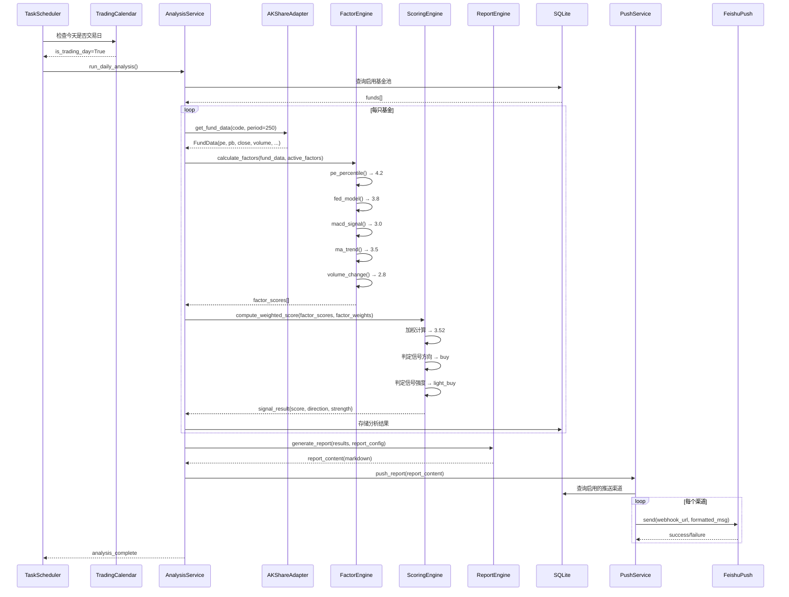
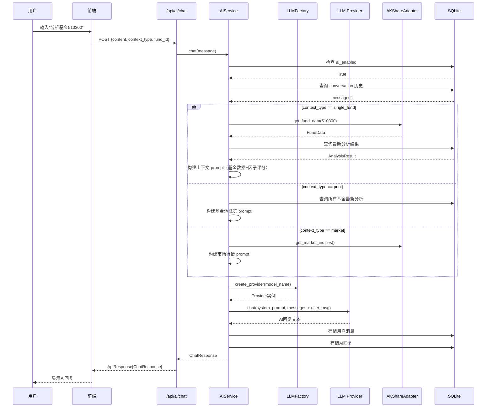
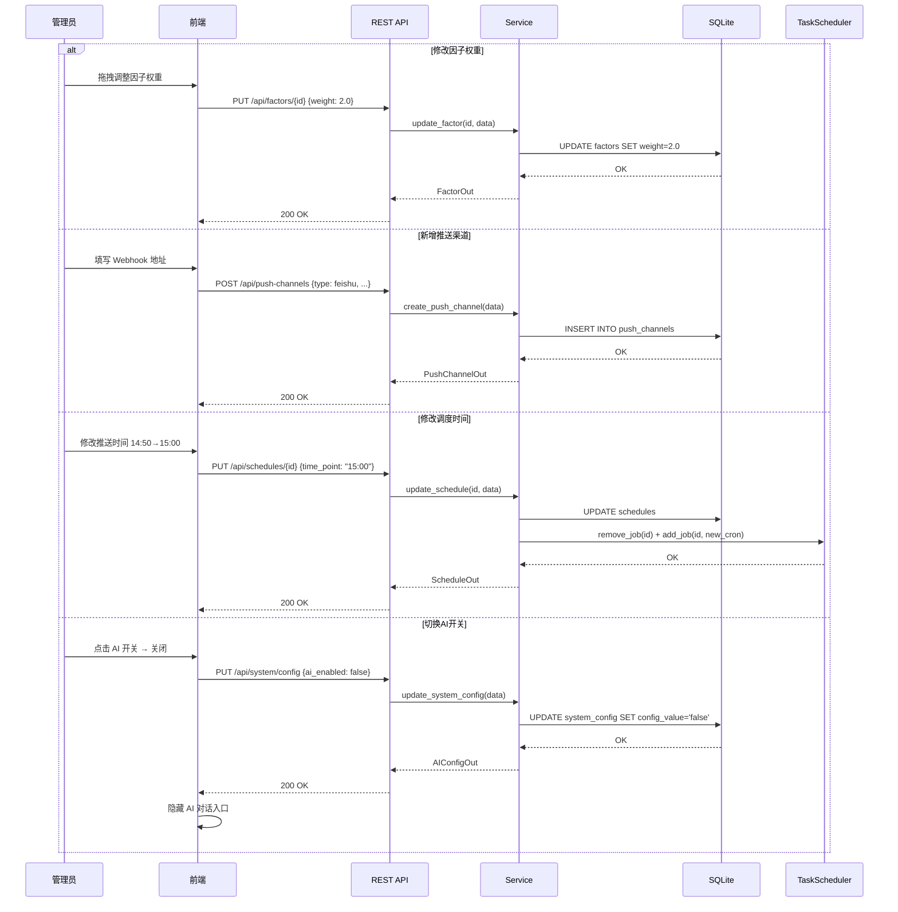
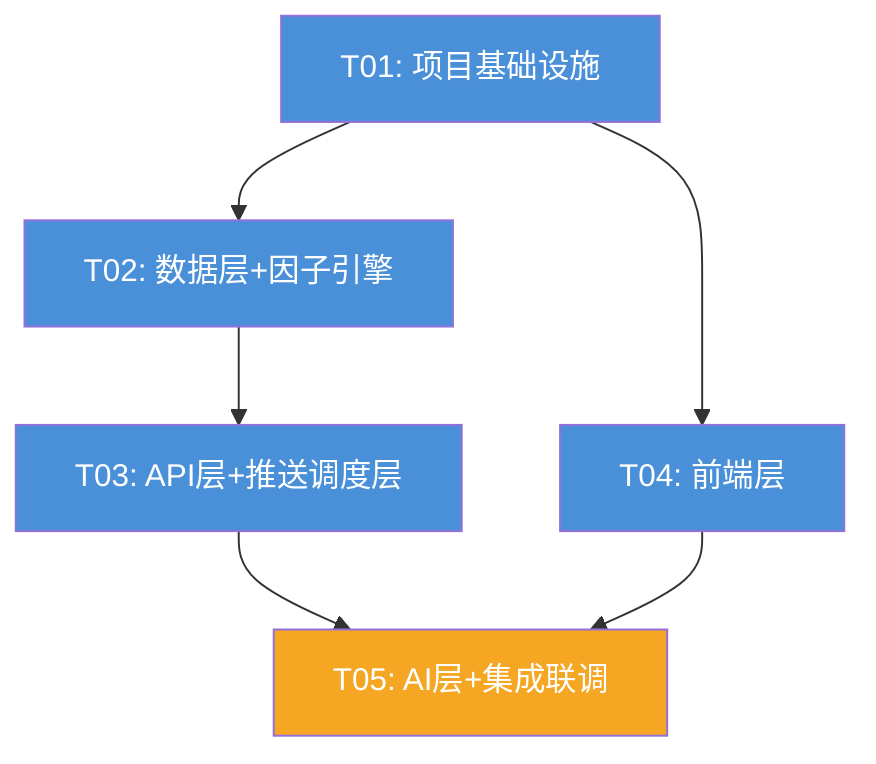

# 基金量化交易系统 — 系统架构设计文档

> 架构师：高见远（Gao） | 版本：v1.0 | 日期：2025-07-09

---

## 1. 实现方案 + 框架选型

### 1.1 整体架构模式

**前后端分离 + REST API**，后端单体服务，前端 SPA。

```
┌─────────────────────────────────────────────────────┐
│                   浏览器 (SPA)                       │
│          Vite + React + MUI + Tailwind CSS           │
└──────────────────────┬──────────────────────────────┘
                       │ HTTP / REST API
                       ▼
┌─────────────────────────────────────────────────────┐
│                 FastAPI 后端服务                       │
│  ┌──────────┐ ┌──────────┐ ┌───────────┐ ┌────────┐ │
│  │ REST API │ │ Scheduler│ │ LLM Agent │ │ Push   │ │
│  │ Routers  │ │ APSched  │ │ Multi-Mdl │ │ Feishu │ │
│  └────┬─────┘ └────┬─────┘ └─────┬─────┘ └───┬────┘ │
│       │            │             │            │      │
│  ┌────▼────────────▼─────────────▼────────────▼────┐ │
│  │              Services / Engines                  │ │
│  │  FundService | FactorEngine | ScoringEngine     │ │
│  │  AnalysisService | PushService | AIService      │ │
│  └───────────────────┬─────────────────────────────┘ │
│                      │                               │
│  ┌───────────────────▼─────────────────────────────┐ │
│  │          Data Sources (AKShare Adapter)          │ │
│  └───────────────────┬─────────────────────────────┘ │
│                      │                               │
│  ┌───────────────────▼─────────────────────────────┐ │
│  │               SQLite Database                    │ │
│  └─────────────────────────────────────────────────┘ │
└─────────────────────────────────────────────────────┘
```

### 1.2 前端框架和关键库选型

| 库 | 版本 | 用途 | 选择理由 |
|---|---|---|---|
| Vite | ^5.4 | 构建工具 | 极速 HMR，开箱即用 TS 支持 |
| React | ^18.2 | UI 框架 | 生态最成熟，PRD 指定 |
| TypeScript | ^5.4 | 类型系统 | 编译期类型安全 |
| @mui/material | ^5.14 | 组件库 | 企业级组件，开箱即用，PRD 指定 |
| Tailwind CSS | ^3.4 | 原子化样式 | 快速布局+自定义配色（红涨绿跌），PRD 指定 |
| React Router | ^6.23 | 路由 | SPA 路由管理 |
| ECharts | ^5.5 | 图表库 | 雷达图、仪表盘、K线图支持最好，中国社区活跃 |
| Axios | ^1.7 | HTTP 客户端 | 请求/响应拦截器统一处理 |
| @dnd-kit/core | ^6.1 | 拖拽排序 | 报告内容项拖拽排序 |
| zustand | ^4.5 | 状态管理 | 轻量，无 boilerplate，适合中等规模应用 |

### 1.3 后端框架和关键库选型

| 库 | 版本 | 用途 | 选择理由 |
|---|---|---|---|
| FastAPI | ^0.111 | Web 框架 | 异步高性能，自动 OpenAPI 文档 |
| Uvicorn | ^0.30 | ASGI 服务器 | FastAPI 标准搭配 |
| SQLAlchemy | ^2.0 | ORM | Python 最成熟的 ORM |
| aiosqlite | ^0.20 | 异步 SQLite | 配合 FastAPI 异步体系 |
| APScheduler | ^3.10 | 定时调度 | 支持 Cron + Date 触发器，轻量够用 |
| akshare | ^1.14 | 基金数据源 | 免费开源，覆盖 A 股基金数据最全 |
| httpx | ^0.27 | HTTP 客户端 | 异步请求，用于飞书 Webhook 和 LLM API |
| pydantic | ^2.7 | 数据校验 | FastAPI 内置，Schema 定义 |
| python-dotenv | ^1.0 | 环境变量 | .env 配置管理 |
| openai | ^1.35 | LLM SDK | OpenAI 兼容接口，DeepSeek/通义千问均适配 |

### 1.4 数据库设计思路

- **SQLite** 单文件数据库，零运维，适合个人/小团队使用
- 使用 SQLAlchemy ORM + 异步引擎 `aiosqlite`
- 所有表含 `created_at` / `updated_at` 时间戳
- 使用 TEXT 类型存储 JSON 配置（SQLite 3.38+ 支持 JSON 函数）
- 索引覆盖高频查询字段（fund_code, analysis_date, conversation_id）

### 1.5 定时任务方案

- **APScheduler** 的 `AsyncIOScheduler`，嵌入 FastAPI 生命周期
- 基于 `chinese_calendar` 库判断交易日
- 两种触发模式：
  - **CronTrigger**：常规定时（如每日 14:50 / 15:30）
  - **DateTrigger**：一次性手动触发
- 启动时从 `schedules` 表加载启用任务；前台增删改后热更新调度器

### 1.6 AI 大模型方案

- 抽象 `BaseLLMProvider` 接口，各模型实现 `chat()` 方法
- 统一使用 OpenAI SDK 的 `chat.completions.create` 接口（DeepSeek / 通义千问均兼容 OpenAI API 格式）
- 通过 `system_config` 表存储当前选中模型 + API Key + Base URL
- 前台切换模型只改配置，不动代码
- AI 总开关：`system_config` 中 `ai_enabled` 字段，关闭时前端隐藏对话入口，后端拒绝 AI 请求

---

## 2. 文件列表及相对路径

（相对于项目根目录 `fund_quant_system/`）

### 后端

```
backend/
├── main.py                          # FastAPI 应用入口、生命周期管理
├── config.py                        # 配置加载（.env + 系统配置表）
├── database.py                      # SQLAlchemy 引擎、Session、初始化
├── requirements.txt                 # Python 依赖
├── models/
│   ├── __init__.py                  # 导出所有模型
│   ├── fund.py                      # Fund ORM 模型
│   ├── factor.py                     # Factor ORM 模型
│   ├── push_channel.py              # PushChannel ORM 模型
│   ├── schedule.py                   # Schedule ORM 模型
│   ├── report_config.py             # ReportConfig ORM 模型
│   ├── analysis_result.py           # AnalysisResult ORM 模型
│   └── system_config.py             # SystemConfig ORM 模型
├── schemas/
│   ├── __init__.py
│   ├── common.py                    # 通用响应 Schema（ApiResponse, PaginatedResponse）
│   ├── fund.py                      # Fund Pydantic Schema
│   ├── factor.py                    # Factor Pydantic Schema
│   ├── push_channel.py              # PushChannel Pydantic Schema
│   ├── schedule.py                   # Schedule Pydantic Schema
│   ├── report_config.py             # ReportConfig Pydantic Schema
│   ├── analysis.py                   # AnalysisResult Pydantic Schema
│   └── ai.py                        # AI 对话 Pydantic Schema
├── routers/
│   ├── __init__.py
│   ├── fund.py                      # /api/funds CRUD
│   ├── factor.py                    # /api/factors CRUD
│   ├── push_channel.py              # /api/push-channels CRUD
│   ├── schedule.py                   # /api/schedules CRUD
│   ├── report_config.py             # /api/report-config CRUD
│   ├── analysis.py                   # /api/analysis 查询 + 手动触发
│   ├── ai_chat.py                   # /api/ai/chat 对话
│   └── system_config.py             # /api/system/config 系统配置
├── services/
│   ├── __init__.py
│   ├── fund_service.py              # 基金业务逻辑
│   ├── factor_service.py            # 因子业务逻辑
│   ├── analysis_service.py          # 分析编排（数据获取→因子计算→评分→信号→存储→推送）
│   ├── push_service.py              # 推送编排（遍历渠道→格式化→发送）
│   └── ai_service.py                # AI 对话业务逻辑
├── engines/
│   ├── __init__.py
│   ├── factor_engine.py             # 因子计算引擎（5 因子注册 + 计算调度）
│   ├── scoring_engine.py            # 加权评分 + 信号生成
│   └── report_engine.py             # 报告内容生成（根据配置项组合）
├── data_sources/
│   ├── __init__.py
│   ├── base.py                      # 抽象数据源接口
│   ├── akshare_adapter.py           # AKShare 数据适配器
│   └── trading_calendar.py          # 交易日历（chinese_calendar 封装）
├── push/
│   ├── __init__.py
│   ├── base.py                      # 抽象推送接口
│   └── feishu.py                    # 飞书 Webhook 推送
├── llm/
│   ├── __init__.py
│   ├── base.py                      # BaseLLMProvider 抽象类
│   ├── factory.py                    # LLM 工厂（根据配置创建 Provider）
│   ├── deepseek_provider.py         # DeepSeek 实现
│   ├── openai_provider.py           # OpenAI 实现
│   └── tongyi_provider.py           # 通义千问实现
└── scheduler/
    ├── __init__.py
    └── task_scheduler.py             # APScheduler 封装（启动/停止/热更新）
```

### 前端

```
frontend/
├── package.json
├── vite.config.ts
├── tsconfig.json
├── tsconfig.node.json
├── tailwind.config.js
├── postcss.config.js
├── index.html
└── src/
    ├── main.tsx                      # React 入口
    ├── App.tsx                       # 路由配置 + 布局
    ├── vite-env.d.ts
    ├── api/
    │   ├── client.ts                 # Axios 实例 + 拦截器
    │   ├── fund.ts                   # 基金 API
    │   ├── factor.ts                 # 因子 API
    │   ├── push.ts                   # 推送 API
    │   ├── schedule.ts               # 调度 API
    │   ├── report.ts                 # 报告配置 API
    │   ├── analysis.ts               # 分析 API
    │   ├── ai.ts                     # AI 对话 API
    │   └── system.ts                 # 系统配置 API
    ├── components/
    │   ├── Layout.tsx                 # 主布局（侧边栏 + 顶栏 + 内容区）
    │   ├── Sidebar.tsx                # 左侧导航栏
    │   ├── Header.tsx                 # 顶部栏（系统名 + AI 开关）
    │   ├── AIChatWidget.tsx           # AI 浮动对话窗口
    │   ├── SignalIndicator.tsx        # 信号灯组件（红涨绿跌）
    │   ├── FactorRadarChart.tsx       # 因子雷达图（ECharts）
    │   ├── ScoreGauge.tsx             # 评分仪表盘（ECharts）
    │   └── ConfirmDialog.tsx          # 通用确认弹窗
    ├── pages/
    │   ├── Dashboard.tsx              # 仪表盘
    │   ├── FundPool.tsx               # 基金池管理
    │   ├── FactorManagement.tsx        # 因子管理
    │   ├── PushConfig.tsx              # 推送配置
    │   ├── ReportConfig.tsx            # 报告配置
    │   ├── SchedulePlan.tsx            # 调度计划
    │   └── HistoryReports.tsx          # 历史报告
    ├── hooks/
    │   ├── useAnalysis.ts              # 分析数据 Hook
    │   └── useAIChat.ts               # AI 对话 Hook
    ├── store/
    │   └── index.ts                    # Zustand 全局状态
    ├── types/
    │   └── index.ts                    # TypeScript 类型定义
    └── styles/
        └── globals.css                # 全局样式 + 红涨绿跌 CSS 变量
```

---

## 3. 数据结构和接口

### 3.1 SQLite 表结构

```sql
-- 基金池
CREATE TABLE funds (
    id          INTEGER PRIMARY KEY AUTOINCREMENT,
    code        VARCHAR(10) NOT NULL UNIQUE,      -- 基金代码 如 510300
    name        VARCHAR(100) NOT NULL,            -- 基金名称 如 沪深300ETF
    fund_type   VARCHAR(20) NOT NULL DEFAULT 'etf', -- etf / otc(场外)
    tags        VARCHAR(200),                       -- 标签 逗号分隔 如 宽基,大盘
    status      VARCHAR(10) NOT NULL DEFAULT 'active', -- active / disabled
    created_at  DATETIME NOT NULL DEFAULT (datetime('now')),
    updated_at  DATETIME NOT NULL DEFAULT (datetime('now'))
);

-- 量化因子
CREATE TABLE factors (
    id          INTEGER PRIMARY KEY AUTOINCREMENT,
    name        VARCHAR(50) NOT NULL,            -- 因子名称 如 PE百分位
    code        VARCHAR(30) NOT NULL UNIQUE,      -- 因子代码 如 pe_percentile
    data_field  VARCHAR(50),                       -- 数据源字段标识
    weight      REAL NOT NULL DEFAULT 1.0,         -- 权重
    direction   VARCHAR(10) NOT NULL DEFAULT 'positive', -- positive(正向) / negative(反向)
    params      TEXT,                              -- JSON 格式参数 {"period": 5}
    status      VARCHAR(10) NOT NULL DEFAULT 'active',
    sort_order  INTEGER NOT NULL DEFAULT 0,
    created_at  DATETIME NOT NULL DEFAULT (datetime('now')),
    updated_at  DATETIME NOT NULL DEFAULT (datetime('now'))
);

-- 推送渠道
CREATE TABLE push_channels (
    id           INTEGER PRIMARY KEY AUTOINCREMENT,
    name         VARCHAR(50) NOT NULL,            -- 渠道名称
    channel_type VARCHAR(20) NOT NULL,             -- feishu / qq
    webhook_url  VARCHAR(500),                     -- Webhook 地址
    token        VARCHAR(200),                     -- Secret / Token
    config       TEXT,                             -- JSON 额外配置
    enabled      BOOLEAN NOT NULL DEFAULT 1,
    created_at   DATETIME NOT NULL DEFAULT (datetime('now')),
    updated_at   DATETIME NOT NULL DEFAULT (datetime('now'))
);

-- 调度计划
CREATE TABLE schedules (
    id           INTEGER PRIMARY KEY AUTOINCREMENT,
    name         VARCHAR(50) NOT NULL,
    cron_expr    VARCHAR(100),                     -- Cron 表达式
    time_point   VARCHAR(10),                      -- 固定时间 HH:MM
    task_type    VARCHAR(20) NOT NULL DEFAULT 'analysis_push',
    channel_id   INTEGER REFERENCES push_channels(id) ON DELETE SET NULL,
    enabled      BOOLEAN NOT NULL DEFAULT 1,
    last_run_at  DATETIME,
    created_at   DATETIME NOT NULL DEFAULT (datetime('now')),
    updated_at   DATETIME NOT NULL DEFAULT (datetime('now'))
);

-- 报告内容配置
CREATE TABLE report_config (
    id          INTEGER PRIMARY KEY AUTOINCREMENT,
    name        VARCHAR(50) NOT NULL,             -- 显示名称
    item_key    VARCHAR(30) NOT NULL UNIQUE,       -- 标识键 如 factor_detail
    enabled     BOOLEAN NOT NULL DEFAULT 1,
    sort_order  INTEGER NOT NULL DEFAULT 0,
    created_at  DATETIME NOT NULL DEFAULT (datetime('now'))
);

-- 分析结果
CREATE TABLE analysis_results (
    id               INTEGER PRIMARY KEY AUTOINCREMENT,
    fund_id          INTEGER NOT NULL REFERENCES funds(id) ON DELETE CASCADE,
    analysis_date    DATE NOT NULL,
    weighted_score   REAL NOT NULL,               -- 加权总分 0-5
    signal_direction VARCHAR(10) NOT NULL,         -- buy / sell / hold
    signal_strength  VARCHAR(20),                  -- light_buy / moderate_buy / heavy_buy 等
    operation_advice TEXT,                          -- 操作建议文本
    factor_scores    TEXT NOT NULL,                -- JSON: {"pe_percentile": 4.2, "fed": 3.8, ...}
    created_at       DATETIME NOT NULL DEFAULT (datetime('now')),
    UNIQUE(fund_id, analysis_date)
);

-- AI 对话历史
CREATE TABLE ai_conversations (
    id              INTEGER PRIMARY KEY AUTOINCREMENT,
    conversation_id VARCHAR(36) NOT NULL,          -- 会话 UUID
    role            VARCHAR(10) NOT NULL,          -- user / assistant
    content         TEXT NOT NULL,
    context_type    VARCHAR(20),                   -- single_fund / pool / market
    fund_id         INTEGER REFERENCES funds(id) ON DELETE SET NULL,
    model_name      VARCHAR(30),
    created_at      DATETIME NOT NULL DEFAULT (datetime('now'))
);
CREATE INDEX idx_ai_conv_id ON ai_conversations(conversation_id);

-- 系统配置（KV 结构）
CREATE TABLE system_config (
    id           INTEGER PRIMARY KEY AUTOINCREMENT,
    config_key   VARCHAR(50) NOT NULL UNIQUE,
    config_value TEXT NOT NULL,
    description  VARCHAR(200),
    updated_at   DATETIME NOT NULL DEFAULT (datetime('now'))
);
-- 预置数据
-- ai_enabled: "true"
-- ai_model: "deepseek"
-- ai_api_key: ""
-- ai_base_url: "https://api.deepseek.com/v1"
-- buy_threshold: "3.5"
-- sell_threshold: "2.0"
```

### 3.2 核心数据模型（Pydantic Schema）

```python
# === schemas/common.py ===
class ApiResponse(BaseModel, Generic[T]):
    code: int = 0          # 0=成功, 非0=错误码
    data: Optional[T] = None
    message: str = "success"

class PaginatedData(BaseModel, Generic[T]):
    items: List[T]
    total: int
    page: int
    page_size: int

class PaginatedResponse(ApiResponse[PaginatedData[T]]):
    pass

# === schemas/fund.py ===
class FundCreate(BaseModel):
    code: str = Field(..., pattern=r'^\d{6}$')
    name: str
    fund_type: Literal['etf', 'otc'] = 'etf'
    tags: Optional[str] = None

class FundUpdate(BaseModel):
    name: Optional[str] = None
    fund_type: Optional[Literal['etf', 'otc']] = None
    tags: Optional[str] = None
    status: Optional[Literal['active', 'disabled']] = None

class FundOut(BaseModel):
    id: int
    code: str
    name: str
    fund_type: str
    tags: Optional[str]
    status: str
    created_at: datetime
    updated_at: datetime

# === schemas/factor.py ===
class FactorCreate(BaseModel):
    name: str
    code: str
    data_field: Optional[str] = None
    weight: float = 1.0
    direction: Literal['positive', 'negative'] = 'positive'
    params: Optional[dict] = None
    sort_order: int = 0

class FactorUpdate(BaseModel):
    name: Optional[str] = None
    weight: Optional[float] = None
    direction: Optional[Literal['positive', 'negative']] = None
    params: Optional[dict] = None
    status: Optional[Literal['active', 'disabled']] = None
    sort_order: Optional[int] = None

class FactorOut(BaseModel):
    id: int
    name: str
    code: str
    data_field: Optional[str]
    weight: float
    direction: str
    params: Optional[dict]
    status: str
    sort_order: int
    weight_percentage: float    # 计算字段：当前权重/总权重*100

# === schemas/analysis.py ===
class FactorScore(BaseModel):
    factor_code: str
    factor_name: str
    raw_value: float
    score: float            # 0-5 标准化评分
    direction: str

class AnalysisResultOut(BaseModel):
    id: int
    fund_id: int
    fund_code: str
    fund_name: str
    analysis_date: date
    weighted_score: float
    signal_direction: str   # buy / sell / hold
    signal_strength: str
    operation_advice: str
    factor_scores: List[FactorScore]
    created_at: datetime

# === schemas/ai.py ===
class ChatMessage(BaseModel):
    content: str
    conversation_id: Optional[str] = None     # 新对话=None, 续聊传ID
    context_type: Optional[Literal['single_fund', 'pool', 'market']] = None
    fund_id: Optional[int] = None

class ChatResponse(BaseModel):
    conversation_id: str
    role: str = "assistant"
    content: str
    model_name: str

# === schemas/system_config.py ===
class AIConfigUpdate(BaseModel):
    ai_enabled: Optional[bool] = None
    ai_model: Optional[str] = None       # deepseek / openai / tongyi
    ai_api_key: Optional[str] = None
    ai_base_url: Optional[str] = None

class AIConfigOut(BaseModel):
    ai_enabled: bool
    ai_model: str
    ai_base_url: str
    # 注意：不返回 api_key
```

### 3.3 API 端点列表

| 方法 | 路径 | 请求体 | 响应体 | 说明 |
|------|------|--------|--------|------|
| GET | /api/funds | - | `ApiResponse[List[FundOut]]` | 基金列表（支持 ?status=active 筛选） |
| POST | /api/funds | `FundCreate` | `ApiResponse[FundOut]` | 新增基金 |
| PUT | /api/funds/{id} | `FundUpdate` | `ApiResponse[FundOut]` | 更新基金 |
| DELETE | /api/funds/{id} | - | `ApiResponse[None]` | 删除基金 |
| PATCH | /api/funds/batch | `{ids, action}` | `ApiResponse[None]` | 批量启用/停用 |
| GET | /api/factors | - | `ApiResponse[List[FactorOut]]` | 因子列表 |
| POST | /api/factors | `FactorCreate` | `ApiResponse[FactorOut]` | 新增因子 |
| PUT | /api/factors/{id} | `FactorUpdate` | `ApiResponse[FactorOut]` | 更新因子 |
| DELETE | /api/factors/{id} | - | `ApiResponse[None]` | 删除因子 |
| GET | /api/push-channels | - | `ApiResponse[List[PushChannelOut]]` | 推送渠道列表 |
| POST | /api/push-channels | `PushChannelCreate` | `ApiResponse[PushChannelOut]` | 新增渠道 |
| PUT | /api/push-channels/{id} | `PushChannelUpdate` | `ApiResponse[PushChannelOut]` | 更新渠道 |
| DELETE | /api/push-channels/{id} | - | `ApiResponse[None]` | 删除渠道 |
| POST | /api/push-channels/{id}/test | - | `ApiResponse[None]` | 测试推送 |
| GET | /api/schedules | - | `ApiResponse[List[ScheduleOut]]` | 调度列表 |
| POST | /api/schedules | `ScheduleCreate` | `ApiResponse[ScheduleOut]` | 新增调度 |
| PUT | /api/schedules/{id} | `ScheduleUpdate` | `ApiResponse[ScheduleOut]` | 更新调度 |
| DELETE | /api/schedules/{id} | - | `ApiResponse[None]` | 删除调度 |
| GET | /api/report-config | - | `ApiResponse[List[ReportConfigOut]]` | 报告配置列表 |
| PUT | /api/report-config | `List[ReportConfigUpdate]` | `ApiResponse[List[ReportConfigOut]]` | 批量更新+排序 |
| GET | /api/analysis | ?date=&fund_id= | `ApiResponse[List[AnalysisResultOut]]` | 分析结果查询 |
| POST | /api/analysis/trigger | `{fund_ids?}` | `ApiResponse[List[AnalysisResultOut]]` | 手动触发分析 |
| GET | /api/analysis/latest | - | `ApiResponse[List[AnalysisResultOut]]` | 最新分析结果 |
| POST | /api/ai/chat | `ChatMessage` | `ApiResponse[ChatResponse]` | AI 对话 |
| GET | /api/ai/conversations | ?conversation_id= | `ApiResponse[List[ChatMessageOut]]` | 对话历史 |
| GET | /api/system/config | - | `ApiResponse[AIConfigOut]` | 获取系统配置 |
| PUT | /api/system/config | `AIConfigUpdate` | `ApiResponse[AIConfigOut]` | 更新系统配置 |

---

## 4. 程序调用流程

### 4.1 交易日定时分析 + 推送流程



### 4.2 AI 对话流程



### 4.3 前台配置变更流程



---

## 5. 任务列表

### T01: 项目基础设施

| 项目 | 内容 |
|------|------|
| **依赖** | 无 |
| **优先级** | P0 |
| **涉及文件** | `backend/main.py`, `backend/config.py`, `backend/database.py`, `backend/requirements.txt`, `backend/models/__init__.py`, `backend/models/fund.py`, `backend/models/factor.py`, `backend/models/push_channel.py`, `backend/models/schedule.py`, `backend/models/report_config.py`, `backend/models/analysis_result.py`, `backend/models/system_config.py`, `backend/schemas/__init__.py`, `backend/schemas/common.py`, `backend/schemas/fund.py`, `backend/schemas/factor.py`, `backend/schemas/push_channel.py`, `backend/schemas/schedule.py`, `backend/schemas/report_config.py`, `backend/schemas/analysis.py`, `backend/schemas/ai.py`, `backend/schemas/system_config.py`, `frontend/package.json`, `frontend/vite.config.ts`, `frontend/tsconfig.json`, `frontend/tsconfig.node.json`, `frontend/tailwind.config.js`, `frontend/postcss.config.js`, `frontend/index.html`, `frontend/src/main.tsx`, `frontend/src/App.tsx`, `frontend/src/vite-env.d.ts`, `frontend/src/styles/globals.css`, `frontend/src/types/index.ts`, `frontend/src/store/index.ts`, `frontend/src/api/client.ts` |
| **预期产出** | 1. 后端 FastAPI 应用可启动（`uvicorn backend.main:app`），数据库自动建表并插入初始因子数据<br>2. 前端 Vite 项目可运行（`npm run dev`），显示空白布局框架<br>3. 所有 ORM 模型、Pydantic Schema 定义就绪 |
| **验收标准** | - `uvicorn backend.main:app` 启动无报错，访问 `/docs` 可见 OpenAPI 页面<br>- SQLite 文件自动创建，含 8 张表<br>- 初始 5 因子已插入 factors 表<br>- 前端 `npm run dev` 可访问，显示 Layout 骨架 |

### T02: 数据层 + 因子引擎

| 项目 | 内容 |
|------|------|
| **依赖** | T01 |
| **优先级** | P0 |
| **涉及文件** | `backend/data_sources/__init__.py`, `backend/data_sources/base.py`, `backend/data_sources/akshare_adapter.py`, `backend/data_sources/trading_calendar.py`, `backend/engines/__init__.py`, `backend/engines/factor_engine.py`, `backend/engines/scoring_engine.py`, `backend/engines/report_engine.py`, `backend/services/__init__.py`, `backend/services/fund_service.py`, `backend/services/factor_service.py` |
| **预期产出** | 1. AKShare 数据适配器可获取基金净值、PE、PB、成交量、指数数据<br>2. 5 个因子计算函数实现：PE百分位、FED模型、MACD信号、MA趋势、成交量变化<br>3. 加权评分引擎实现，含信号方向判定和分档逻辑<br>4. 报告生成引擎，根据配置项组合输出 Markdown/HTML |
| **验收标准** | - `akshare_adapter.get_fund_data("510300")` 返回完整数据<br>- `factor_engine.calculate_all(fund_data, factors)` 返回 5 个因子评分<br>- `scoring_engine.compute(factor_scores, weights)` 返回信号方向+强度<br>- 评分 ≥3.5 判定为 buy，≤2.0 判定为 sell<br>- 3.5-4.0 = light_buy, 4.0-4.5 = moderate_buy, ≥4.5 = heavy_buy |

### T03: API层 + 推送调度层

| 项目 | 内容 |
|------|------|
| **依赖** | T02 |
| **优先级** | P0 |
| **涉及文件** | `backend/routers/__init__.py`, `backend/routers/fund.py`, `backend/routers/factor.py`, `backend/routers/push_channel.py`, `backend/routers/schedule.py`, `backend/routers/report_config.py`, `backend/routers/analysis.py`, `backend/routers/system_config.py`, `backend/services/analysis_service.py`, `backend/services/push_service.py`, `backend/push/__init__.py`, `backend/push/base.py`, `backend/push/feishu.py`, `backend/scheduler/__init__.py`, `backend/scheduler/task_scheduler.py` |
| **预期产出** | 1. 所有 REST API 端点实现，CRUD 完整<br>2. 飞书 Webhook 推送实现，消息格式为卡片消息<br>3. APScheduler 集成，支持从 schedules 表加载定时任务<br>4. 完整的分析编排流程：获取数据→计算因子→评分→存储→推送 |
| **验收标准** | - 所有 API 端点可通过 Swagger UI 测试通过<br>- `POST /api/analysis/trigger` 可手动触发分析并返回结果<br>- 飞书测试推送可收到卡片消息<br>- 定时任务可按配置时间触发分析+推送 |

### T04: 前端层

| 项目 | 内容 |
|------|------|
| **依赖** | T01 |
| **优先级** | P0 |
| **涉及文件** | `frontend/src/api/fund.ts`, `frontend/src/api/factor.ts`, `frontend/src/api/push.ts`, `frontend/src/api/schedule.ts`, `frontend/src/api/report.ts`, `frontend/src/api/analysis.ts`, `frontend/src/api/system.ts`, `frontend/src/components/Layout.tsx`, `frontend/src/components/Sidebar.tsx`, `frontend/src/components/Header.tsx`, `frontend/src/components/SignalIndicator.tsx`, `frontend/src/components/FactorRadarChart.tsx`, `frontend/src/components/ScoreGauge.tsx`, `frontend/src/components/ConfirmDialog.tsx`, `frontend/src/pages/Dashboard.tsx`, `frontend/src/pages/FundPool.tsx`, `frontend/src/pages/FactorManagement.tsx`, `frontend/src/pages/PushConfig.tsx`, `frontend/src/pages/ReportConfig.tsx`, `frontend/src/pages/SchedulePlan.tsx`, `frontend/src/pages/HistoryReports.tsx`, `frontend/src/hooks/useAnalysis.ts` |
| **预期产出** | 1. 7 个页面组件全部实现，与后端 API 对接<br>2. 信号灯红涨绿跌配色<br>3. ECharts 雷达图和仪表盘组件<br>4. 侧边栏导航 + 顶栏 AI 开关 |
| **验收标准** | - 所有页面可正常访问，数据从 API 加载<br>- 仪表盘显示今日信号概览，红涨绿跌配色正确<br>- 基金池 CRUD 完整，可新增/编辑/删除/批量操作<br>- 因子权重调节实时显示百分比<br>- 推送配置可增删改+测试连接<br>- 报告配置可拖拽排序 |

### T05: AI层 + 集成联调

| 项目 | 内容 |
|------|------|
| **依赖** | T03, T04 |
| **优先级** | P1 |
| **涉及文件** | `backend/llm/__init__.py`, `backend/llm/base.py`, `backend/llm/factory.py`, `backend/llm/deepseek_provider.py`, `backend/llm/openai_provider.py`, `backend/llm/tongyi_provider.py`, `backend/services/ai_service.py`, `backend/routers/ai_chat.py`, `frontend/src/api/ai.ts`, `frontend/src/components/AIChatWidget.tsx`, `frontend/src/hooks/useAIChat.ts` |
| **预期产出** | 1. LLM 抽象接口 + 3 个 Provider 实现<br>2. AI 对话 API + 前端浮动对话窗口<br>3. 快捷指令（分析基金池/选中基金/市场行情）<br>4. AI 开关控制前后端联动<br>5. 全链路集成验证通过 |
| **验收标准** | - AI 开关关闭时，前端无对话入口，后端返回 403<br>- AI 开关打开时，浮动对话窗口可正常对话<br>- 切换 DeepSeek/OpenAI/通义千问 可正常使用<br>- "分析基金510300" 返回含因子评分的综合分析<br>- 定时任务 → 因子分析 → 推送全链路可跑通 |

---

## 6. 依赖包列表

### 6.1 后端 requirements.txt

```
fastapi==0.111.0
uvicorn[standard]==0.30.1
sqlalchemy==2.0.31
aiosqlite==0.20.0
pydantic==2.7.4
apscheduler==3.10.4
akshare==1.14.3
httpx==0.27.0
python-dotenv==1.0.1
openai==1.35.0
chinese-calendar==1.9.1
```

### 6.2 前端 package.json 关键依赖

```json
{
  "dependencies": {
    "react": "^18.2.0",
    "react-dom": "^18.2.0",
    "react-router-dom": "^6.23.1",
    "@mui/material": "^5.14.0",
    "@mui/icons-material": "^5.14.0",
    "@emotion/react": "^11.11.0",
    "@emotion/styled": "^11.11.0",
    "echarts": "^5.5.0",
    "echarts-for-react": "^3.0.2",
    "axios": "^1.7.2",
    "zustand": "^4.5.2",
    "@dnd-kit/core": "^6.1.0",
    "@dnd-kit/sortable": "^8.0.0",
    "uuid": "^9.0.0"
  },
  "devDependencies": {
    "@types/react": "^18.2.0",
    "@types/react-dom": "^18.2.0",
    "@types/uuid": "^9.0.0",
    "typescript": "^5.4.0",
    "vite": "^5.4.0",
    "@vitejs/plugin-react": "^4.3.0",
    "tailwindcss": "^3.4.0",
    "postcss": "^8.4.0",
    "autoprefixer": "^10.4.0"
  }
}
```

---

## 7. 共享知识（跨文件约定）

### 7.1 API 响应格式

```json
{
  "code": 0,
  "data": { ... },
  "message": "success"
}
```

- `code=0` 成功，`code>=1` 业务错误，`code<0` 系统错误
- 错误码定义：`1`=参数校验失败, `2`=资源不存在, `3`=数据源异常, `4`=推送失败, `5`=AI 服务不可用

### 7.2 红涨绿跌配色约定

```css
:root {
  --signal-buy: #E74C3C;      /* 红色 — 加仓/上涨 */
  --signal-sell: #27AE60;     /* 绿色 — 减仓/下跌 */
  --signal-hold: #95A5A6;     /* 灰色 — 观望 */
  --signal-buy-light: #FADBD8;
  --signal-sell-light: #D5F5E3;
}
```

### 7.3 代码风格约定

- 后端：PEP 8，类型注解全覆盖，async 函数统一用 `async def`
- 前端：ESLint + Prettier，函数式组件 + Hooks，Props 用 interface 定义
- 数据库字段命名：snake_case
- API 路径命名：kebab-case（如 `/api/push-channels`）
- 前端文件命名：PascalCase 组件，camelCase 工具函数

### 7.4 错误处理约定

- 后端：全局 `@app.exception_handler` 捕获未处理异常，返回统一 `ApiResponse`
- 数据源异常：捕获后返回因子评分为 null，不中断整体分析
- 推送失败：记录日志，3 次重试（间隔 1min/5min/15min），失败后标记但不影响存储
- 前端：Axios 拦截器统一处理 4xx/5xx，Snackbar 展示错误消息

### 7.5 配置文件格式约定

- 环境变量：`.env` 文件，`FUND_QUANT_` 前缀
- 数据库运行时配置：`system_config` 表 KV 结构
- 因子参数：`factors.params` 字段，JSON 格式
- 推送渠道额外配置：`push_channels.config` 字段，JSON 格式

---

## 8. 待明确事项

| # | 问题 | 当前假设 | 影响范围 |
|---|------|---------|---------|
| 1 | 卖出信号阈值？PRD 写"卖出信号≥3分"语义不明 | 假设加权分 ≤2.0 为卖出信号 | scoring_engine.py |
| 2 | 卖出分档逻辑？PRD 只定义了买入分档 | 假设 ≤2.0 light_sell, ≤1.5 moderate_sell, <1.0 heavy_sell | scoring_engine.py |
| 3 | 场外基金实时数据获取方式？ | 假设使用 AKShare 场外基金估值接口，无估值时使用上一交易日净值 | akshare_adapter.py |
| 4 | 因子历史数据回看窗口？ | 假设 PE 百分位回看 5 年，MA20/60 回看 120 天，MACD 回看 120 天 | factor_engine.py |
| 5 | AI 对话单次 token 上限？ | 假设 max_tokens=2048，上下文保留最近 10 轮对话 | ai_service.py |
| 6 | 是否需要 HTTPS？ | 假设本地运行 HTTP 即可 | vite.config.ts, uvicorn |
| 7 | 推送消息模板是否可自定义？ | 当前硬编码飞书卡片模板，后续迭代可支持 | push/feishu.py |

---

## 9. 任务依赖图



> 说明：T04 可与 T02/T03 并行开发，只需 T01 的项目基础设施就绪即可开始。
