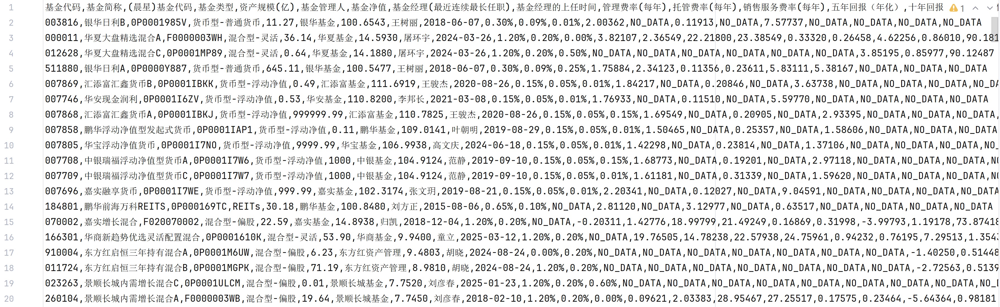
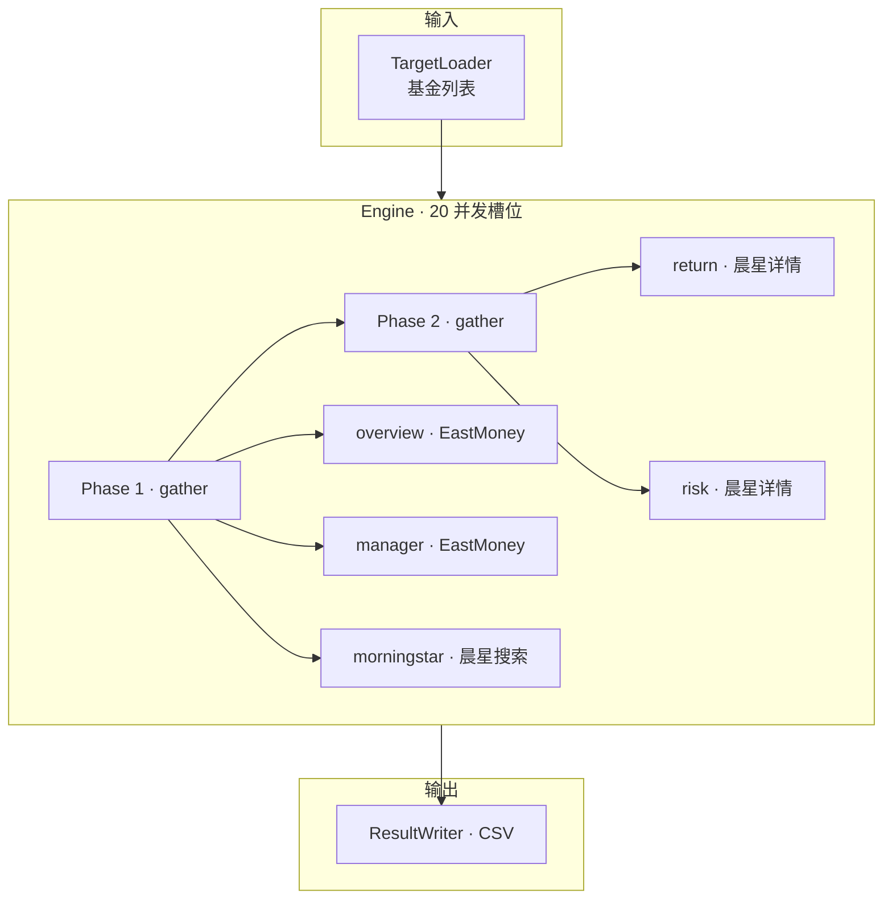
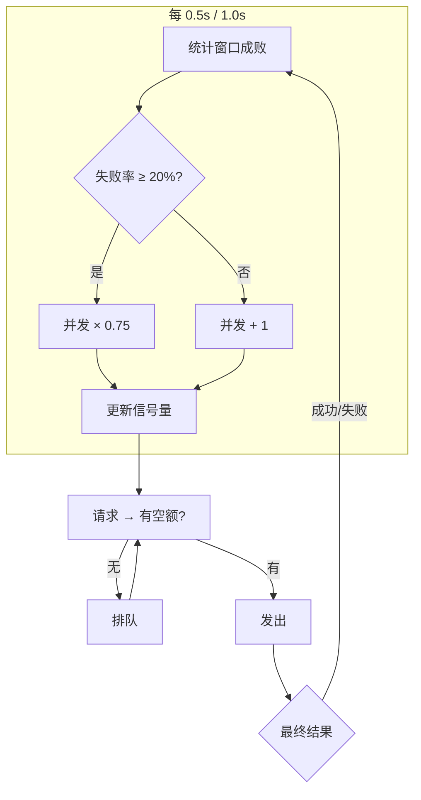

# 基金数据爬虫

#### 重要提示

- 202605 重大代码修改（纯DS设计+编码），报错/奇怪bug，尝试切换PreviousReleaseVersion分支使用

        购买基金前，请务必在官方网站上确认爬取的数据无误！
        爬虫仅供学习交流使用，请不要对目标网站造成负担，并在心里默默感谢网站提供的免费数据
        推荐书籍《聪明的投资者》、《投资最重要的事》
        推荐网站 晨星中国：www.morningstar.cn

- 爬取的数据

        所有的开放式基金（包括目前暂停申购和认购中的基金，不包括货币/场内基金）
        基金代码,基金简称,(晨星)基金代码,基金类型,资产规模(亿),基金管理人,基金净值
        基金经理(最近连续最长任职),基金经理的上任时间
        管理费率(每年),托管费率(每年),销售服务费率(每年)
        五年回报(年化),十年回报(年化)
        标准差(五年%),标准差(十年%),夏普比率(五年),夏普比率(十年)
        阿尔法系数(相对于基准指数%),贝塔系数(相对于基准指数),R平方(相对于基准指数)

- 爬取全部数据需要30min左右（21032个基金），取决于网络环境，瓶颈为网站的反爬策略

# 食用方法

- Python3.14
- 安装依赖 pip install -r requirements.txt
- 爬取基金数据
  - 结果保存在 result/result.csv
  - 运行test_run.py 爬一点点数据看下效果
  - 运行run.py 爬取完整数据
- 爬取结果分析，参考 result_analyse.py

# 技术相关

每只基金 5 个数据源，按依赖自动分两阶段——morningstar ID 就绪后 Phase 2 才开始。每个 phase 内 `gather` 并行，瓶颈只取决于最慢的那个 step。

### 动态并发控制

三个域名各自独立 AIMD，在线探测失败率自动收敛——不需要人工设定"每个域名最多 N 并发"。

### 扩展点

换基金来源 → 实现 `TargetLoader`；加数据源 → 添加 `Step` 到 `STEPS`；换输出格式 → 替换 `ResultWriter`。
